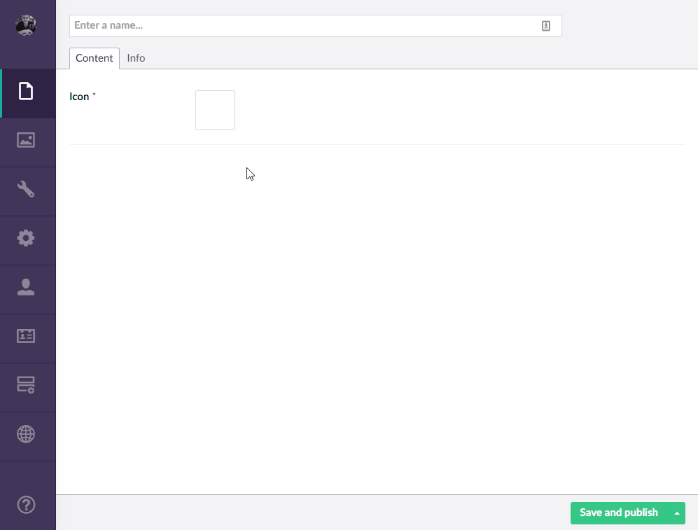
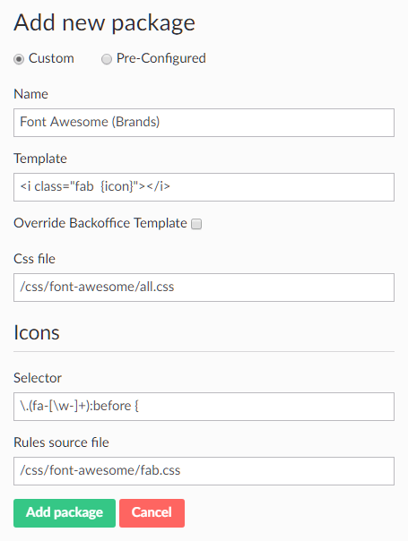
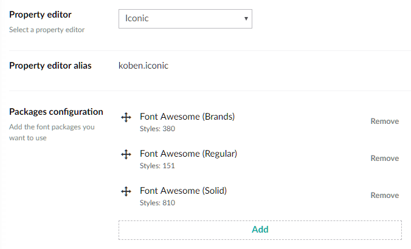

The highly configurable [Iconic package for Umbraco](https://our.umbraco.com/packages/backoffice-extensions/iconic/) allows you to easily add icon font pickers to your document types.

There is an out-of-the-box example for Font Awesome 4, however Font Awesome 5 had a change of syntax in the icons (instead of a generic `.fa` class you must now use `.fab`, `.far` or `fas` depending on the icon).

A couple of people were asking on the [Umbraco Forum](https://our.umbraco.com/packages/backoffice-extensions/iconic/feedback/93686-iconic-for-fontawesome-pro) and [Slack channel](https://umbracians.slack.com/archives/C06G5LWBV/p1536756157000100) how to go about using Iconic with Font Awesome 5, and I needed the Font Awesome icons for a project I’m currently working on at [Agency97](https://www.agency97.com/) so I thought I’d put a post up about how I got it working.

## The result



## What’s needed

You will need the following files (this uses _Font Awesome Free 5.3.1_ which is the latest freely available version as of this post):

* [Font Awesome 5 Free files for use with Iconic in Umbraco](/download/Font-Awesome-5-Free-files-for-use-with-Iconic-in-Umbraco.zip)

These should be uploaded to the root of your site, so you end up with this structure:

```text
css/
    font-awesome/
          all.css
          fab.css
          far.css
          fas.css
fonts/
      fa-brands-400.eot
      fa-brands-400.svg
      fa-brands-400.ttf
      fa-brands-400.woff
      fa-brands-400.woff2
      fa-regular-400.eot
      fa-regular-400.svg
      fa-regular-400.ttf
      fa-regular-400.woff
      fa-regular-400.woff2
      fa-solid-900.eot
      fa-solid-900.svg
      fa-solid-900.ttf
      fa-solid-900.woff
      fa-solid-900.woff2
```

Once these files are uploaded we can go and configure Iconic.

Go ahead and create your new data type inside of ‘Settings’ and choose the Iconic property editor, then in its configuration select ‘Add’ and use the following settings:



For ease of copy and paste, here’s the text:

```
Name                 Font Awesome (Brands)
Template             <i class="fab {icon}"></i>
Css file             /css/font-awesome/all.css
Selector             \.(fa-[\w-]+):before {
Rules source file    /css/font-awesome/fab.css
```

This will setup Font Awesome brands, we now need to repeat this for the regular and solid icons. Click ‘Add’ and use the following settings for each:

```
Name                 Font Awesome (Regular)
Template             <i class="far {icon}"></i>
Css file             /css/font-awesome/all.css
Selector             \.(fa-[\w-]+):before {
Rules source file    /css/font-awesome/far.css
```

```
Name                 Font Awesome (Solid)
Template             <i class="fas {icon}"></i>
Css file             /css/font-awesome/all.css
Selector             \.(fa-[\w-]+):before {
Rules source file    /css/font-awesome/fas.css
```

Once done you should end up with a final configuration of:



Don’t forget to ‘Save’ the data type; then you can go and use it in your document types.

The magic of how this works is the separated CSS files for the three icon types; **brands**, **regular** and **solid**. Creating these was a slight faff as by default Font Awesome 5 doesn’t separate these out, so I needed to manually separate them.

I did this using the Font Awesome icons page (e.g. [https://fontawesome.com/icons?d=gallery&s=brands&m=free](https://fontawesome.com/icons?d=gallery&s=brands&m=free)) where I extracted the HTML from the source (after loading all icons in that category) and then used some regular expression find and replace to alter the HTML into the CSS syntax required.

I hope this helps anybody struggling to use Font Awesome 5 with Iconic in Umbraco 😊

## Update: 18 Sep

So I created a Github repository where I have placed both the **free** and **pro** CSS files for **brands**, **regular** and **solid**. This can be found at [https://github.com/christopherrobinson/Font-Awesome-Icons/tree/master/css](https://github.com/christopherrobinson/Font-Awesome-Icons/tree/master/css)
