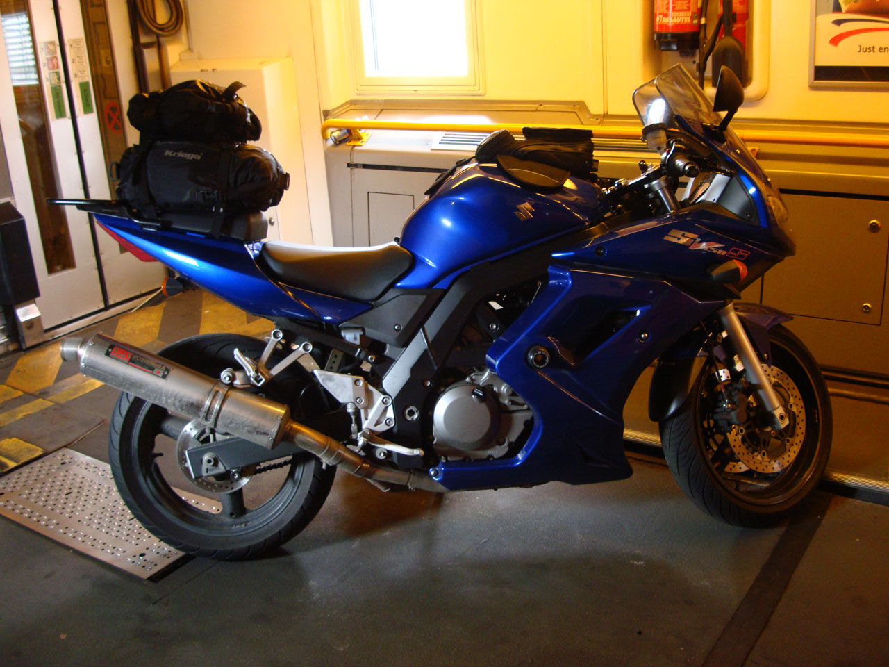
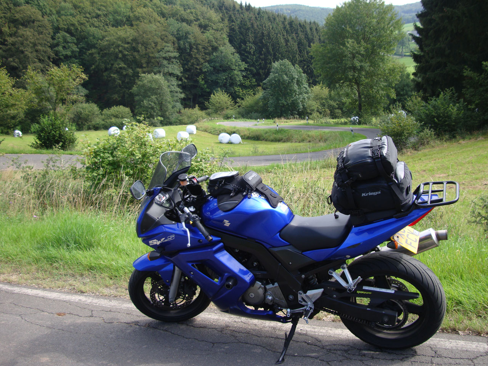
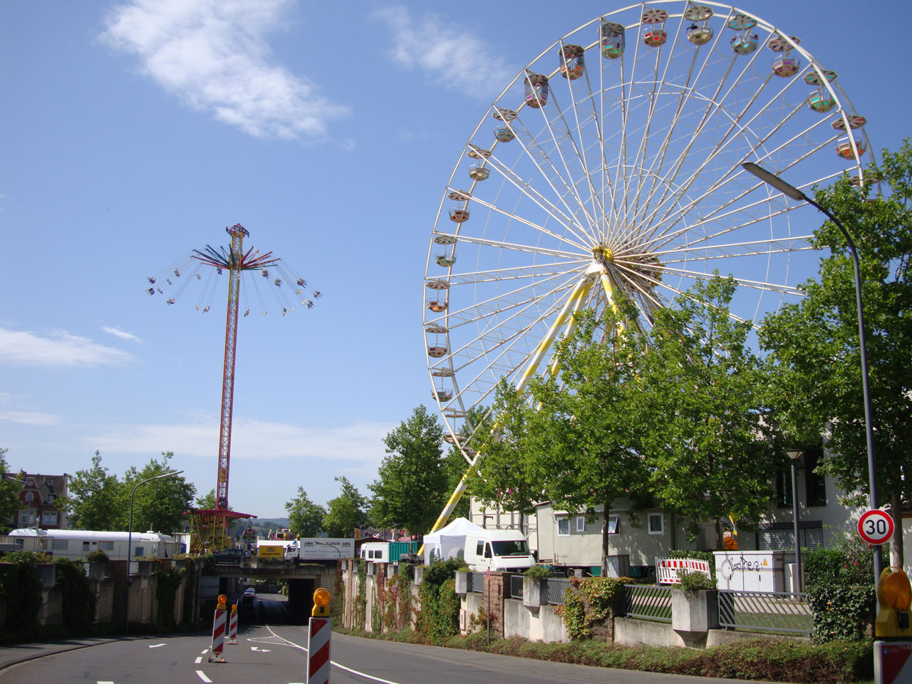
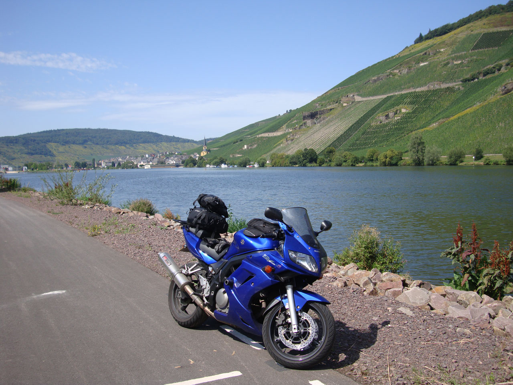
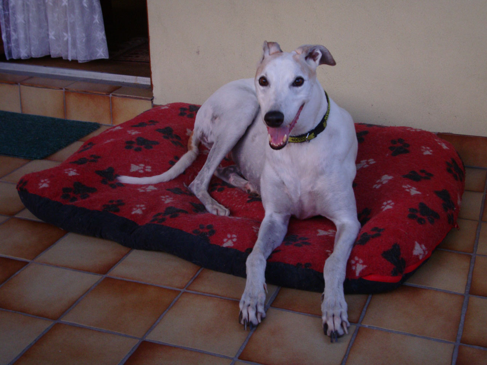
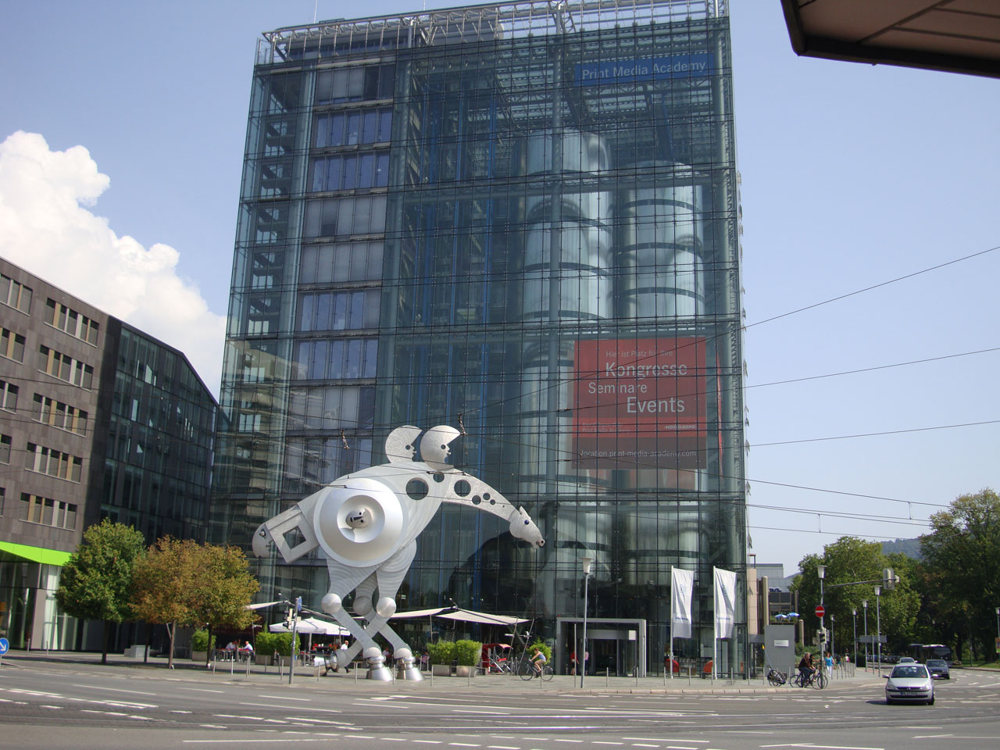
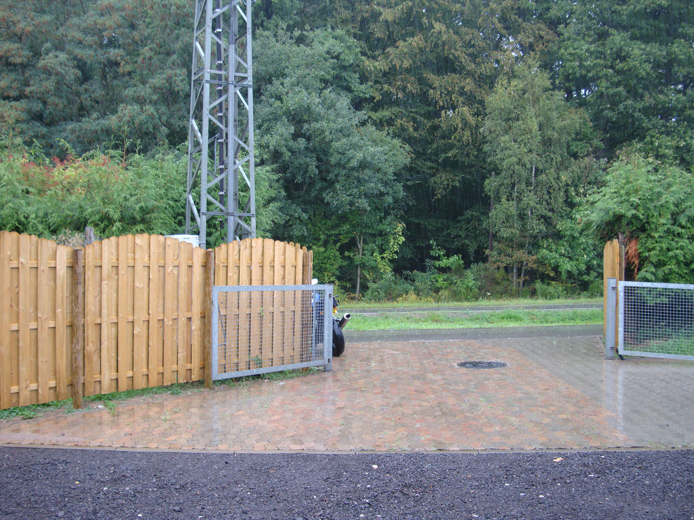

It’s 9 o’clock in the morning, August 20th 2011\. Breakfast consumed, bike loaded and I’m ready to roll. Let’s go! I’m only on the road for a little over an hour before the rain starts coming down heavy around Birmingham so I pull over into a refuge area at the side of the M6 to quickly put waterproofs on. Just 10 minutes later and the rain has stopped. Typical.

Pull into [Corley Services](https://maps.google.co.uk/maps?q=Corley+Services,+CV7+8NR&cid=4070147064973746731&z=11 "(Opens in a new window)") to fuel up and remove waterproofs as I’m now roasting in them. Have a drink then set off again. Onto the M1 and down to the M25 where I hit lots of traffic. Filtering (weaving through the traffic…) commences. Stop at the services just before the Dartford Crossing for fuel and a snack then off again.

Filter over the bridge getting stuck behind a cautious Italian BMW 1200GS with pillion and a lot of luggage. He pulls to one side and lets me past. Get to the booths and roll through. More filtering at the other side until about 5 miles later it starts to clear up. Clear run down the M20 playing with an old convertible Porsche until it pulled off around Ashford. Scanning the bridges in case of police sitting on them but not a single one seen all day.

Pull into the services a junction before the Eurotunnel. Brim the tank as it’s cheaper over here than abroad. Go to get credit card and passport to hand ready for checking in. Credit card is there. But where’s my passport? All my other documents are there, driving licence, insurance, <abbr title="Vehicle Registration Document">V5</abbr>, even the current <abbr title="Ministry of Transport">MOT</abbr> certificate. ********. It’s not here. Quick phone call home tells me it’s in my bedroom. Well I’m not going back now. I’ll take my chances at the tunnel.

Go straight for the automated check-in, arrived 3 hours earlier than I’d booked for (as the later bookings were a fair bit cheaper and it normally lets you change to an earlier crossing without any hassle). Get the ticket for the next train and onwards to customs/border control. Fingers crossed.

Nobody on the English booths, good start. Lots of French at theirs though. Please don’t get stopped. Please. Ease up to the booth with ticket in hand and say hello. A quick glance and waves me through without wanting to look at my passport. Yippee! Didn’t much fancy the trek home and back!

Less than an hour later I’m on the French motorways heading for the hotel in Aalst, Belgium. Tag onto the back of an English plated Nissan GTR doing about 100mph. Stay behind it for about 80 miles until we hit a bit of traffic and give each other the thumbs up and I filter through. The sound of that GTR accelerating from 40-120mph was gorgeous! Enter services just before the Aalst turn off to fuel up ready for the morning then head to the hotel and check-in. Get ready to put the bike into the underground car park (one of the main reasons I use this hotel) only to be told it’s undergoing cleaning and out of bounds. Not having much luck so far. Ah well bike left round the back out of the way. Up to my room, shower, change, then walk the mile and a half into the centre of Aalst. Been snacking throughout the day and not all that hungry. Find a kebab house and get a chicken kebab with a ton of salad and chips in it. Washed down with a bottle of Jupiler. Yummy.

Wander back into the main square and have another couple of beers and sit watching the street entertainers juggling with music, fire, and general stupidity till about 11pm before wandering back to the hotel to pack up ready for the morning.

## Day 2

Awake at 6am to the sound of heavy rain. Get up and look out of the window. Haha. I’m going back to bed. Don’t need to check-out till midday and it’s only 3 hours from here direct to Mike’s place, though I’d rather take the scenic route hence the planned early start.

Couple more hours in bed and up for a shower at 8.30am with the rain stopped and skies starting to clear. Plan a slightly more scenic route once over the border into Germany then check-out and load up the bike, on the road for 10am. 100 miles or so covered and I’m getting peckish. Pull into the services around Spa for fuel and food/coffee.

Come off the autobahn and go through bits of the German-Luxembourg Nature Park. Satnav told to favour tiny roads. It finds them. Switchback after switchback covered in gravel. After 600 miles of motorway the tyres aren’t feeling too great here. Pull over and redo the satnav for slightly larger roads. This is more like it. Fast sweeping bends, after a bit the tyres are feeling better.

Tag onto the back of a few German bikes fully loaded. End up going past them as they’re not moving very quickly. The middle one of the group splits and follows me. Errm. End up doing about 20 miles with us doing a decent pace before he flies up alongside, nods, then eases off and pulls over next to a junction. Presumably to wait for the others.

Not far from Mike’s place now. Going through a town called Wittlich and spot a fun fair. One of the many examples of all the wine/beer festivals taking place over the coming month in this region. Attempt to go through the centre to see what’s there but they’re all cordoned off. Can’t be bothered trying to find a way in or parking up and walking as it’s starting to get hot.

Off again and nearing Mosel you can see the constant mile upon mile of grapevines. See signs for Zeltingen-Rachtig, almost there!

Arrive at 2.45pm. Told Mike I’d be there around 3pm so not a bad guess. Get to a large house and there’s lot’s of names on the door, it’s split into two. Ring the one that says Michael. No answer. Not to worry. Sit outside for 10 minutes when a neighbour opposite comes out to say he’s out in the car.

It’s very warm now, decide to get back on the bike and ride a cafe or something close by. Sunday afternoon and all I could find open was a petrol station a few miles away. It’ll do. Grab a coffee then head back at about 3.30pm.

He’s still not in. Hmm. Don’t have a mobile number, just the house phone. And there’s no answer at the door so I’m not going to call that. Sounds logical right?

It’s now 3.45pm and still nothing. I want to dump my gear then head off for the Nürburgring for the evening session from 5.30-7.30pm. At 4pm a bloke comes out from the house next door, sees my plate, and says loudly “Grosse Brittannia!”. “Ja” I reply. “With Mike?” he asks. “Ja” I say again. Pretty much the only bit of German I know apart from how to order beer, despite studying it for 5 years back in school!

“Ah” the bloke says, and motions me to follow him. Eh? Where we going? Down the street and swing a left into another. See three English vehicles… you’re kidding me. I was sat outside the wrong house!? Say thanks to this bloke and then go knock on the door. Mike answers. He’s been in all afternoon. I should have called!

The place I was sitting outside was the same number as Mike’s but in a different street (was on the corner). Although Mike’s place also faces onto a different street. What a coincidence that the other place had someone called Michael as well. Never mind, I’m here now at least.

It’s 4.15pm now and I want to shoot off, Mike knows this. A quick explanation and hello then shown the basics and given a key to house and garage to put the bike in. Then I’m off. Not an ideal start and a bit rude of me, hope he doesn’t mind!

Take the scenic route to the ‘ring from Mike’s. Took about 1 hour 15 minutes. Get to the ‘ring for 5.30pm and it’s not as busy as I remember it on last year’s evening sessions. Go and buy a lap, €24, ouch! Sure it was €18 last year.

Onto the track and yeah, who cares about the price, it’s worth ever cent. That is until a British M5 almost forces me off track. How I stayed on the tarmac I don’t know. Going through one of the early right left rights and it comes screeching up the inside of me and runs wide forcing me to be an inch from the curb desperately banked over then throwing it the other way hoping it’ll get by. Makes me realise what the bike is capable of as I don’t ever corner that hard, fast or leant over by choice. I’ll happily admit I was scared at that moment!

Let the M5 go ahead and ease off for a few corners to regain composure and get a bit of distance between me and it. Rest of the lap is uneventful but much fun, that is until I catch up to the M5\. Do. Not. Want. Stay behind it giving lots of room, has four lads in it and being driving awfully and without regard for anyone else. Overtaking on both sides and not keeping right when faster vehicles are trying to get past.

On the main straight and come off track behind it. It floors it out to the roundabout, hurls round then shoots off at speed. Mental. I turn straight into the car park and park outside the ticket office to get another lap.

Second lap completed with a mostly clear run, pegs scraping down and thoroughly enjoyed that one. Fuel light on solid so have to go fill up. Then head off for some food before heading back to Mike’s.

Just want to get back so hit the autobahn as should be more like 45 minutes. Road works plus diversions sees me arriving back about 9.15pm. Took almost an hour longer than expected. Should have taken the scenic route!

A proper hello when I get back, then a quick shower and change. That’s better. Cup of tea. Bit of a chat. Beer. More talk. The dogs – greyhounds – are all very curious about the visitor… all very friendly and inquisitive.

10.45pm and the dogs need to go out. Mike takes then and I write a few notes of the day’s events. Reliving the horrible moment on the ‘ring with the M5.

Mike gets back and we chat randomly till about 1.15am then head off for bed. Until tomorrow!

## Day 3

Awake at about 8am. Up and weather looking okay. Have a shower and get into my leathers ready for a day’s riding. Have breakfast about 8.30am, continental but Mike did offer bacon sandwiches if preferred. Nice fresh rolls from the bakery plus meat, cheese and jams. Selection of cereals, hard boiled eggs, tea and juice. Excellent.

All set and ready to go about 10am. Starts spitting with rain as I’m in the garage putting helmet and gloves on. Decide to wait a moment. Within 20 minutes the brief shower has passed and no more rain was seen all day.

Set off with Heidelberg as the destination on the back roads after Mike and his wife Lynne recommended it as a nice city. Apart from wanting to do the ‘ring again I had no plans for this trip and just got ‘lost’ most days enjoying the roads then using the satnav to find my way back later in the day.

Within an hour and a half the heat is immense. Go through a load of villages and one of them is basically being torn up by the looks of it. Every road is either closed or has sections of the road missing. The main street looks the best of the bunch, just a section about 50 metres long with a bit of a kerb at either end down into gravel/rock. Decide to take my chances and ride through past the no entry blockades. Will play the dozy foreigner if I get stopped and hope for the best. Out the other end and back onto tarmac then some very nice little roads once out of the village.

It’s around 35°C when I get into Heidelberg. In leathers. Trying to walk round without any breeze. The air is still. Sorry Heidelberg, another time maybe. Find a café and grab lunch plus drinks then make a move after taking a photo of some random sculpture and speaking with a crazy jazz playing American who sparked up a conversation as I was gearing up. Didn’t want to speak to him to start with as I was boiling and wanted to get riding and feel the air to cool down but he was an interesting guy and we spent close to an hour talking in the end.

Take a different route back then about 10 miles from Mike’s place hit an amazing road. Apparently people see it as a local race track and there were dirt buggies flying up and down. Virtually no other traffic though (except when I went to take a photo of one of the buggies!). Likely different at a weekend I imagine. At the bottom of the road is a tunnel. Open the throttle, sod the 50km/h speed limit! Turn round and do it and the road again. Then back a final time before going back to Mike’s.

Mike and Lynne are out with the dogs. I have a shower, change, then head out for some food. End up deciding on schweineschnitzel, chips and salad washed down with Erdinger. Wander off from the restaurant and find a little place doing deserts. Have a slice of a berry sponge cake and more beer.Back to the house and grab one of the books Mike has put out along with a load of magazines, end up starting to read Red Tape and White Knuckles by Lois Pryce. There’s a fridge outside the room with beer and wine, plus a bottle of red of top that Mike provided – it’d be rude not to drink some eh! This is turning out to be an excellent place to stay, struck lucky here.

## Day 4

Similar start to yesterday morning but with the addition of a pain au chocolat. As I hadn’t seen Mike the evening before he was eager to hear what I’d been up to and share some route ideas for the day if I wanted any. All taken on board and notes of roads/place names noted I set off around 10.30am.

Followed a few of the roads Mike suggested, they’re good. Then peel off for Cochem on the back roads.

There’s a theme appearing here… more road closures. Find a different route. The alternative I had to take was great, quite glad I was forced down it actually!

Arrive in Cochem and park up in a square next to a load of other bikes. Get some food and a drink, have a quick wander round this part but again it’s far too hot for this for me in leathers.

Aim for Nürburg as there’s meant to be a decent road from there to Monschau. The 258\. Mike had also mentioned it. It was nice but a bit open and fast for my liking in places. Come back a different way on smaller roads.

Get back to Nürburg and head for the ‘ring. Get there about 4.30pm. Starts to spit with rain then goes within 30 minutes. When the track opens at 5.30pm I wait half an hour. Feedback of it being a bit damp for the second half but a dry line is there from the other vehicles.

Get out and do one lap, pass 2 bikes in a barrier and a VW Golf on a grass verge. Everyone was up and standing around by the looks of it but one of the bikes didn’t look in a good shape. Front end smashed.

Finish the lap and get back to find the track closed due to a couple of accidents. Not knowing how long it’ll be till they’re cleared or if it will even reopen at all this evening I head off after a brief chat with a couple of English bikers.

Take the scenic route back, chances are those diversions are still in place on the autobahn! Into the little town next to Mike’s place and grab a bit of food.

Then back to Mike’s and spend the evening chatting and having a couple of beers before heading for bed at around 12.45am. Conversation comes easy and both Mike and Lynne and very easy to get on with and talk to about all sorts of subjects.

## Day 5

It’s my last full day here. Tomorrow I make a move for the overnight boat from IJmuiden to Newcastle before heading up to Edinburgh.

Wake up to the sound of rain, have breakfast at usual time but don’t head out on the bike until about 12.30pm. Spend the morning continuing reading the book by Lois Pryce while the rain stops and roads dry out a bit.

I’m going to head to a place called Maubach. The map shows a good looking twisty road leading out from there and it’s not far away. Get there and hit the road, this is promising. Nice and flowing with a great mix of slower/tighter corners as well as longer ones.

Come up behind two German bikes but like most I encountered while over here, they’re not riding very quickly. Exit a bend and go to pass on a straight and they open the throttle… oh come on. Stay out as can see way round the next bend and pass them as they ease off for the corner.

Couple of corners later and the skies are darkening and there are flashes of lightning in the distance. Urgh. Please stay away. Onto a longish straight and towards the end see a wall of rain! Damn. Consider slamming on and turning round to try and out run it but the way the road twists and turns it wouldn’t have made much difference. Ride into it. Then realise my jacket is virtually unzipped to let air in and I get drenched. Do it up while on the move but getting soaked here.

See a farm with an outhouse up a short path a little further up the road so dive up there and park the bike and make a run for cover. Start to get waterproofs on when a short tubby German bloke waddles over wondering why I’m there.

Doesn’t speak a word of English and my German is appalling, but a series of hand movements later signalling to the bike, me, the rain and the cover he seems fine and after a smile walks off into the house.

Rain eases off after about 30 minutes so I make a move for the nearest town to find somewhere for food and shelter. Only 15 miles or so away from the house now so decide to head back, can’t be bothered staying out in this weather. Back to Mike’s by about 3pm I think it was. Get changed and have a beer and continue reading the book. Even if it clears I’m not interested in going up to the ‘ring later on. Can always come back another time. Don’t need to use it every day just for the sake of it when the weather is like this as it’s not exactly cheap either. More beer.

Couple of beers enjoyed, bit more of the book read and talking with Mike. Then a walk down into Zeltingen for a pizza. Then back to the house and head off out for a few drinks with Mike in Rachtig. Good beer and good company. A wonderful evening so far!

We get back to the house at whatever time it was, around 11.30pm I think, to find that Lynne has baked a chocolate birthday cake for me! Was not expecting that! So a cup of tea, some cake, and lots more conversation then off to bed around 2.15am after packing final bits of gear for tomorrow.

## Day 6

I’m writing this after the day’s events and just thinking about it makes me cringe.

The morning was perfect as always, breakfast then loaded up the bike. Said our goodbyes (though I will be back and keeping in touch) and off I set for the boat in Ijmuiden at about 10.30am.

Got their early so hung around for a bit before being allowed to check-in. As expected I couldn’t board without my passport, which was at home.

I was told to go the main office, fill in a form and have it stamped by them which would be valid for one day’s travel to get me back into the UK to then report it missing and deal with it there. Sorted. Or so I thought.

After spending 90 minutes in the office, the information I eventually found out was that apparently recently new policy/regulations came in which meant that all sea and air transport could no longer be made without a passport unless the British Embassy authorised it. So this form I was told about no longer exists… great.

And what I needed had to be dealt with in person. Alright. So where is the closest British Embassy? Düsseldorf. Grrr. It was unlikely to be sorted that day by the time I got there. So the ferry was rearranged for the next day and I was contemplating a night in a hotel in Düsseldorf. Not what I wanted really, as I wanted to get back to the UK and up to Edinburgh.

Now I thought I should have been able to get an ETD (Emergency Travel Document) from the British Consulate-General in Amsterdam. But they were as equally unhelpful as DFDS Seaways and I got the idea they didn’t want to help same day.

So there I am in IJmuiden with no real option of the boat without messing about sorting out the passport. I didn’t fancy spending days sorting it out abroad. So what did I decide to do? I jumped on the bike and rode down to Calais to try my luck with the Eurotunnel instead.

Waved through the French border control, but the English were stopping/checking everyone so I explained the situation. Because the British are at the tunnel it was very simple to sort there and then.

30 minutes later I was on a train to the UK. Unfortunately my passport is now cancelled (same procedure for lost/stolen/forgotten, basically voids the passport and you need to apply for a new one). Cost is the same as a renewal, current one would have expired in 2014 so I’ve lost 2½ years basically. Not a massive problem. I can deal with that.

Got the train at about 9.45pm local time. Off to find the weather was horrible. Pouring with rain and pretty windy. Roadworks on the M25 meant it was down to single lane. The cones were about a third of the way into the next lane. So if vehicles shifted left a bit I could get past comfortably. The ones that didn’t move I could get past if careful.

All was going well until I noticed one of the cones was closer in by some way than the rest. Didn’t manage to avoid it and ended up whacking my hand on the reflector on top of this cone. That hurt. So much for being careful.

Rest of the ride back was alright (well as much as motorway riding at night in the rain can be) once I hit the M6\. Cruising along at a slightly less than legal speed, fuel consumption dropped to around 24mpg. Oops.

Finally walked through the door of home at about 1am, 800 miles after setting off from Mike’s.

## Day 7

So after riding 800 miles yesterday from Mike’s place to IJmuiden, to Calais, on the train to Folkestone, then up to home in Chester with a few detours here and there the tyres (Michelin Pilot Road 3’s) had been killed off after a grand total of 5800 miles.

Few hours sleep after a rubbish day then up and through to local tyre place hoping they had some new ones in the correct fitment. Well, they had the right sizes, but were for someone else to be fitted the next day… bit of charm and they were on my bike within 20 minutes! Sorted.

The guy who was meant to be getting them got a phone call saying a defect was found and they had to order another one of them. Sorry to whomever that was!

Left home yesterday all repacked with fresh tyres at about 11am. Took the scenic route up including the Lakes taking in Kirkstone Pass etc. New tyres, wet weather, and those roads (including part of the Kirkstone Pass being resurfaced) wasn’t ideal but was a hell of a lot of fun if I’m honest. Tyres amazing from the start and took no effort to scrub in.

Got to Edinburgh 300 miles later at about 4.45pm. Had some good food and a drink then reflected on the mess that was yesterday. Was an expensive and stupid mistake forgetting the passport. And one I’ll be sure not to repeat! Also meant I missed out on part of Northumberland as was meant to go from Newcastle to Edinburgh up the east side, so need to get there at some point!

## Day 8/9/10

Weather was poor and didn’t much fancy going out on the bike while like this – especially not after the past couple of days. So end up having a lazy day not doing much!

The next day I went out on [this run](http://forums.sv650.org/showthread.php?t=168621 "(Opens in a new window)") with some of the SV650.org bunch. Was enjoyable!

Final day and time for the ride back home. Straight onto the motorway for the return journey – boring but quick!
