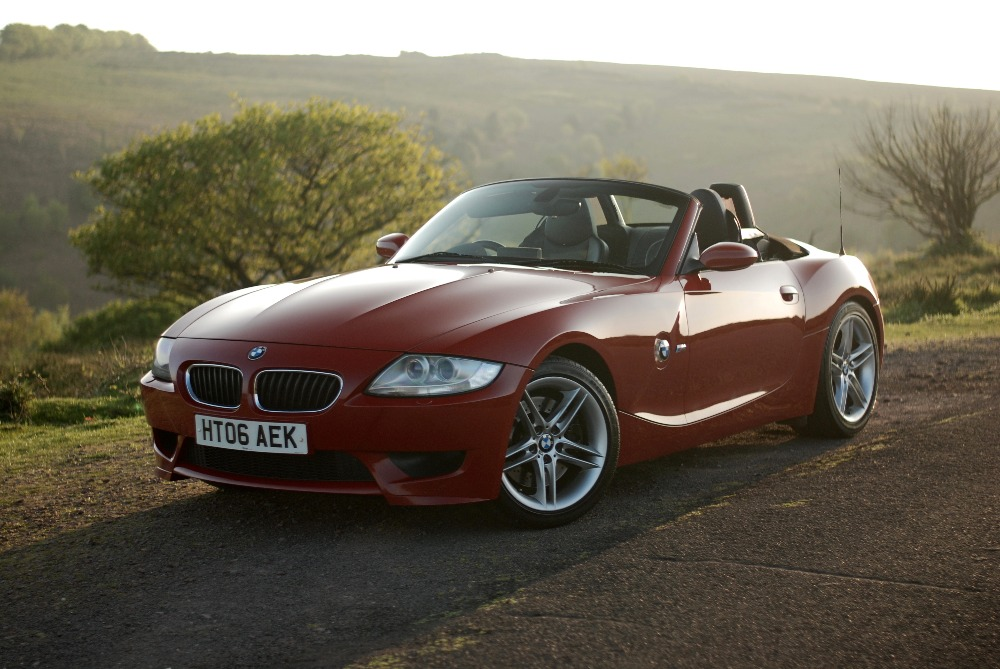
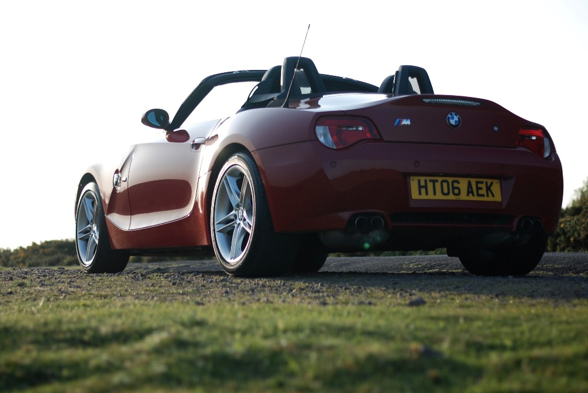
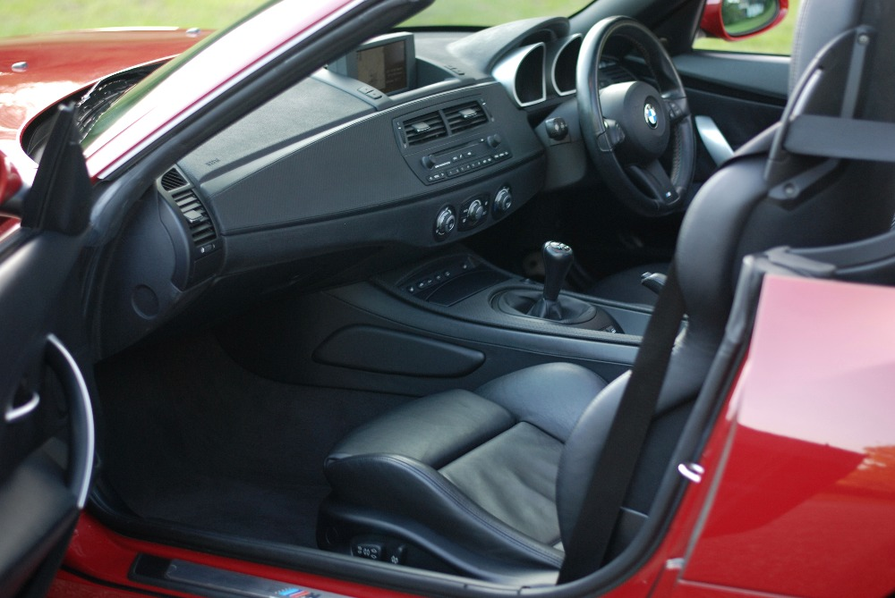
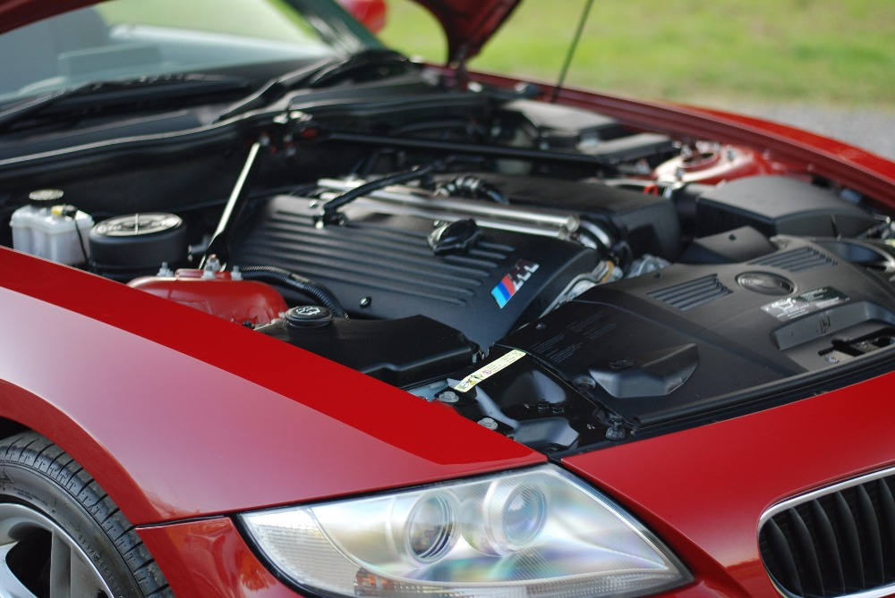

After about 18 months of limited use with the motorbike, I decided to cross something else off my ‘bucket list’. I’ve wanted a rear-wheel drive convertible for some time, and after looking at various Mazda MX5’s and Honda S2000’s, I decided to blow the budget and picked up a BMW Z4M instead.

It is finished in Imola Red with the extended black leather and carbon trim interior. It has done 52k miles and is pretty much fully specced (including the digital/freeview television option!) apart from missing cruise control and an aux input; which I read is easily resolved.

Unfortunately it was located down in Minehead, Somerset. Went down and collected it this morning and drove it the 240 miles home after purchasing and so far am impressed at the comfort and pace. I’m much more of a motorbike person, and the quickest previous car was a 2004 (MK1) Audi TT 3.2 DSG w/ Quattro (which made for an awesome long distance tourer). The Z4M as expected blows the TT out of the water performance wise!

The only slight reservation is around the limited storage space as I’d like to use it later in the year for a decent trip over to continental Europe. It will of course be taken around the Nürburgring just like the previous cars and bikes (although I’ve only ridden/driven around 50 laps in total).

Now enough blurb, have a couple of photos taken from the sellers advert! I’ll get some of my own once it’s been detailed and tidied up a little…

